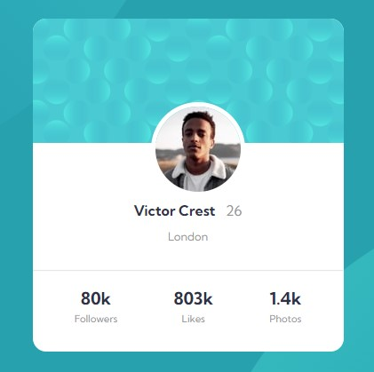

# Frontend Mentor - Profile card component solution

This is a solution to the [Profile card component challenge on Frontend Mentor](https://www.frontendmentor.io/challenges/profile-card-component-cfArpWshJ). Frontend Mentor challenges help you improve your coding skills by building realistic projects.

## Table of contents

- [Overview](#overview)
  - [The challenge](#the-challenge)
  - [Screenshot](#screenshot)
  - [Links](#links)
- [My process](#my-process)
  - [Built with](#built-with)
  - [What I learned](#what-i-learned)
  - [Useful resources](#useful-resources)
- [Author](#author)
- [Acknowledgments](#acknowledgments)

## Overview

### The challenge

A perfect challenge to test one's layout skills.

### Screenshot

### Links

- Solution URL: [Solution page](https://github.com/okutewonah/fm-profile-card-component)
- Live Site URL: [View live](https://okutewonah.github.io/fm-profile-card-component/)

## My process

### Built with

- Semantic HTML5 markup
- CSS custom properties
- Flexbox

### What I learned

First time I tried using two patterns (or images) as background

### Useful resources

- [The CSS Reset](https://www.joshwcomeau.com/css/custom-css-reset/#the-css-reset) - Made CSS reset easy for me.

## Author

- Frontend Mentor - [@okutewonah](https://www.frontendmentor.io/profile/okutewonah)
- Github - [okutewonah](https://github.com/okutewonah)
